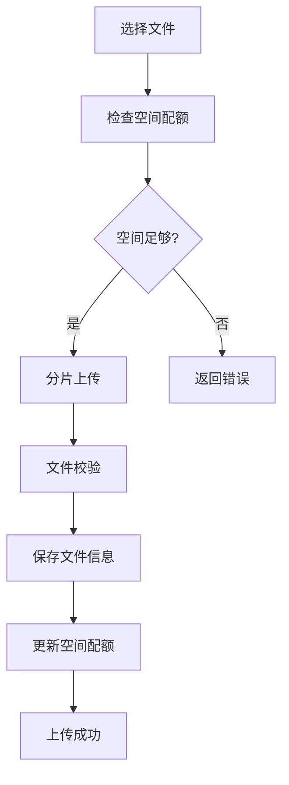
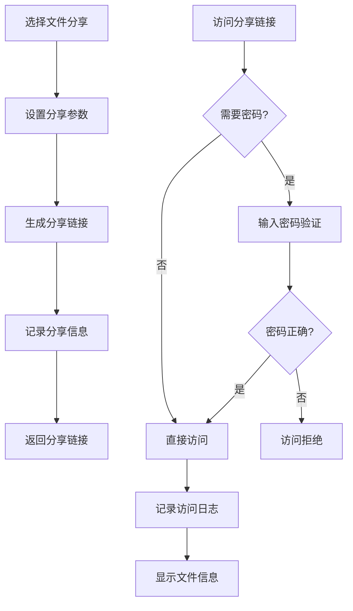
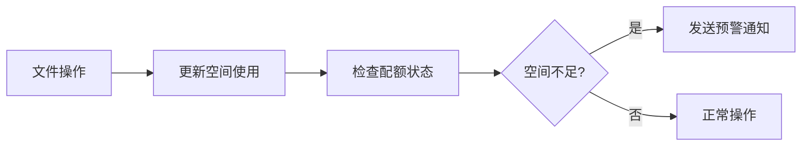

# deepseek建议

### **1. 当前问题快速解决**

- **头像显示问题**：按照之前提到的图片路径解决方案修正即可。
- **中文文件名**：建议将 `烈焰飞鸟.png` 改为英文（如 `avatar.png`），避免潜在兼容性问题。

---

### **2. 网站功能增强建议**

#### **（1）学习笔记系统**
- **Markdown支持**：集成Markdown编辑器（如 [Vditor](https://vditor.js.org/) 或 [ToastUI Editor](https://ui.toast.com/tui-editor)），方便编写技术笔记。
- **分类/标签**：为笔记添加学科分类（如「机器学习」「Web开发」）和技术标签（如「Vue」「PyTorch」）。
- **搜索功能**：实现按关键词搜索笔记内容。

#### **（2）项目展示优化**
- **动态演示**：为项目添加GIF预览或在线Demo链接（如GitHub Pages或Vercel部署）。
- **代码片段展示**：集成代码高亮组件（如 [Prism.js](https://prismjs.com/)），直接展示核心代码。

#### **（3）学习进度追踪**
- **时间轴视图**：用甘特图或日历形式展示学习计划完成情况。
- **技能树**：可视化你的技术栈掌握程度（如D3.js绘制雷达图）。

---

### **3. 技术实现推荐**
- **前端**：保持Vue 3 + Element Plus，适合快速开发。
- **后端（可选）**：
  - 轻量级：Firebase 或 Supabase（实时数据库+认证）
  - 全栈：Express + MongoDB 或 Python Flask/Django
- **部署**：Vercel（前端） + Railway（后端），学生可免费使用。

---

### **4. 后续问题准备**
你可以随时问我以下类型的问题：
- **功能实现**：  
  - "如何在我的网站中添加暗黑模式？"  
  - "怎样实现笔记的Markdown实时预览？"
- **技术细节**：  
  - "Vue 3的Pinia状态管理如何集成？"  
  - "如何用Docker部署我的全栈项目？"
- **设计建议**：  
  - "学习进度页面用什么可视化图表最合适？"  
  - "移动端布局如何优化？"

---

### **5. 立即行动建议**
1. **基础框架**：先完善当前页面的路由（如`/notes`、`/projects`）。
2. **数据模拟**：用`mockjs`模拟API返回笔记和项目数据。
3. **版本控制**：确保代码已上传GitHub，便于迭代和备份。

需要我详细解释任何一点，或协助解决具体问题，请随时告诉我！ 🚀

（提示：下次提问时可以直接说需求，比如："我想加一个搜索笔记的功能，代码应该怎么写？"）

# 代码

```
from flask import request, jsonify
from app import app, db
from app.service.mnist_service import MNISTPredictor
from app.service.cifar10_service import CIFAR10Predictor


class Result:
    def __init__(self, code=200, message='success', data=None):
        self.code = code
        self.message = message
        self.data = data

    def to_dict(self):
        return {
            'code': self.code,
            'message': self.message,
            'data': self.data
        }


# 初始化服务
mnist_predictor = MNISTPredictor(app.config['MNIST_MODEL_PATH'])
cifar10_predictor = CIFAR10Predictor(app.config['CIFAR10_MODEL_PATH'])


@app.route('/mnist/predict', methods=['POST'])
def mnist_predict():
    if 'image' not in request.files:
        return jsonify(Result(400, 'No image uploaded').to_dict())

    try:
        file = request.files['image']
        if not file.filename.lower().endswith(('.png', '.jpg', '.jpeg')):
            return jsonify(Result(400, 'Invalid image format').to_dict())

        result = mnist_predictor.predict(file.read())
        return jsonify(Result(data=result).to_dict())
    except Exception as e:
        return jsonify(Result(500, str(e)).to_dict())


@app.route('/cifar10/predict', methods=['POST'])
def cifar10_predict():
    if 'file' not in request.files:
        return jsonify(Result(400, '请上传图片文件').to_dict())

    try:
        file = request.files['file']
        if not file.filename.lower().endswith(('.png', '.jpg', '.jpeg')):
            return jsonify(Result(400, '仅支持PNG/JPG/JPEG格式').to_dict())

        result = cifar10_predictor.predict(file.read())
        return jsonify(Result(data=result).to_dict())
    except Exception as e:
        return jsonify(Result(500, f'预测失败: {str(e)}').to_dict())


# 测试数据库连接
@app.route('/test_db', methods=['GET'])
def db_test():
    try:
        db.engine.connect()  # 直接使用全局db对象
        return "MySQL 连接成功！"
    except Exception as e:
        return f"MySQL 连接失败: {str(e)}"

```

# flask应用

## 1、创建项目

* 项目目录

  ```
  E:\codefile\code-space-loc\
  └── flask-parts/
      ├── app/
      │   ├── controller/
      │   │   ├── predict_controller.py  
      │   │   └── user_controller.py     
      │   ├── models/
      │   │   ├── models.py              
      │   │   └── user.py                
      │   ├── repository/                
      │   ├── service/
      │   │   ├── cifar10_service.py     
      │   │   └── mnist_service.py       
      │   ├── utils/                     
      │   └── __init__.py                
      ├── model_save/
      │   ├── mnist_cnn_net02.pth        
      │   └── net_0.pth                  
      ├── config.py                      
      └── run.py                         
  ```

  | 层级           | 目录          | 职责              | 示例         |
  | :------------- | :------------ | :---------------- | :----------- |
  | **表现层**     | `controller/` | 处理HTTP请求/响应 | 路由定义     |
  | **业务逻辑层** | `service/`    | 业务规则处理      | 用户注册逻辑 |
  | **数据访问层** | `repository/` | 数据库直接交互    | 用户数据查询 |

  如果规模不大的话，直接在控制层就可以完成所有操作。

  ```mermaid
  graph TD
      A[创建app] --> B[加载配置]
      B --> C[初始化db]
      C --> D[导入模型]
      D --> E[注册控制器]
      E --> F[路由装饰器生效]
  ```

  

* flask配置

  

## 2、连接数据库

[Flask 数据库操作 | 菜鸟教程](https://www.runoob.com/flask/flask-orm.html)

**==使用 SQLAlchemy：定义模型，配置数据库，执行基本的 CRUD 操作。==**

* 安装依赖：

  ```shell
  pip install flask-sqlalchemy
  
  # 先清除缓存
  conda clean --all -y
  
  # 然后尝试用清华源安装
  conda install -c https://mirrors.tuna.tsinghua.edu.cn/anaconda/cloud/conda-forge pymysql
  
  # 如果仍然失败，改用pip安装
  pip install pymysql -i https://pypi.tuna.tsinghua.edu.cn/simple
  ```

* `config.py`

  ```python
  import os
  
  
  class Config:
      # 模型路径配置
      MNIST_MODEL_PATH = './model_save/mnist_cnn_net02.pth'
      CIFAR10_MODEL_PATH = './model_save/net_0.pth'
  
      # 其他配置
      SECRET_KEY = os.environ.get('SECRET_KEY') or 'dev-key-123'
  
      # 数据库配置
      MYSQL_HOST = os.getenv('MYSQL_HOST', 'localhost')
      MYSQL_USER = os.getenv('MYSQL_USER', 'root')
      MYSQL_PASSWORD = os.getenv('MYSQL_PASSWORD', '12369')
      MYSQL_DB = os.getenv('MYSQL_DB', 'personal_learning_platform')
  
      # 动态生成 SQLAlchemy 连接 URI
      SQLALCHEMY_DATABASE_URI = f'mysql+pymysql://{MYSQL_USER}:{MYSQL_PASSWORD}@{MYSQL_HOST}/{MYSQL_DB}?charset=utf8mb4'
      SQLALCHEMY_TRACK_MODIFICATIONS = False  # 禁用事件系统（推荐）
  ```

* `__init__.py`：初始化文件

  ```python
  from flask import Flask
  from flask_sqlalchemy import SQLAlchemy
  from config import Config
  
  """
  先创建所有扩展实例
  
  然后创建Flask应用
  
  接着加载配置
  
  最后初始化数据库
  
  确保一切就绪后才导入路由
  """
  
  
  # 创建扩展实例
  db = SQLAlchemy()
  
  # 创建Flask应用
  app = Flask(__name__)
  
  # 加载配置
  app.config.from_object(Config)
  
  # 初始化数据库
  db.init_app(app)
  
  # 注意：这个导入必须放在最后！
  # 确保在app和db初始化完成后再导入路由
  from app import routes
  ```

* `routers.py`

  ```python
  from flask import request, jsonify
  from app import app, db  # 从app模块导入已初始化的db
  from app.services.mnist_service import MNISTPredictor
  from app.services.cifar10_service import CIFAR10Predictor
  
  
  class Result:
      def __init__(self, code=200, message='success', data=None):
          self.code = code
          self.message = message
          self.data = data
  
      def to_dict(self):
          return {
              'code': self.code,
              'message': self.message,
              'data': self.data
          }
  
  
  # 初始化服务
  mnist_predictor = MNISTPredictor(app.config['MNIST_MODEL_PATH'])
  cifar10_predictor = CIFAR10Predictor(app.config['CIFAR10_MODEL_PATH'])
  
  
  @app.route('/mnist/predict', methods=['POST'])
  def mnist_predict():
      if 'image' not in request.files:
          return jsonify(Result(400, 'No image uploaded').to_dict())
  
      try:
          file = request.files['image']
          if not file.filename.lower().endswith(('.png', '.jpg', '.jpeg')):
              return jsonify(Result(400, 'Invalid image format').to_dict())
  
          result = mnist_predictor.predict(file.read())
          return jsonify(Result(data=result).to_dict())
      except Exception as e:
          return jsonify(Result(500, str(e)).to_dict())
  
  
  @app.route('/cifar10/predict', methods=['POST'])
  def cifar10_predict():
      if 'file' not in request.files:
          return jsonify(Result(400, '请上传图片文件').to_dict())
  
      try:
          file = request.files['file']
          if not file.filename.lower().endswith(('.png', '.jpg', '.jpeg')):
              return jsonify(Result(400, '仅支持PNG/JPG/JPEG格式').to_dict())
  
          result = cifar10_predictor.predict(file.read())
          return jsonify(Result(data=result).to_dict())
      except Exception as e:
          return jsonify(Result(500, f'预测失败: {str(e)}').to_dict())
  
  
  # 测试数据库连接
  @app.route('/test_db', methods=['GET'])
  def db_test():
      try:
          db.engine.connect()  # 直接使用全局db对象
          return "MySQL 连接成功！"
      except Exception as e:
          return f"MySQL 连接失败: {str(e)}"
  
  ```

* `run.py`

  ```python
  from app import app  # 从 app/__init__.py 文件中导入 app 实例
  
  # # 方案B（工厂函数模式）
  # from app import create_app
  # app = create_app()
  
  if __name__ == '__main__':
      app.run(port=5000)
  
  ```


# 关联多个仓库

## 关键概念：本地仓库 vs. 远程仓库

1. **`git add` + `git commit`**
   - 只在**本地仓库**记录变更
   - 与远程仓库无关（无论关联多少个远程仓库）
2. **`git push`**
   - 将本地提交推送到指定的**远程仓库**
   - 每个远程仓库（如 `origin`、`gitee`）需要单独推送

## 步骤 1：检查当前远程仓库配置

在本地项目目录下运行：

```
git remote -v
```

## 步骤 2：添加第二个远程仓库

### 方法一：直接添加远程仓库

```
git remote add gitcode https://gitcode.net/你的用户名/项目名.git
```

（将 `gitcode` 替换为任意别名，如 `gc`）

### 方法二：修改 `.git/config` 文件

手动编辑本地仓库的 `.git/config` 文件，添加如下内容：

```
[remote "gitcode"]
    url = https://gitcode.net/你的用户名/项目名.git
    fetch = +refs/heads/*:refs/remotes/gitcode/*
```

## 步骤 3：推送到多个远程仓库

### 修改远程地址为 SSH：

```
git remote set-url github git@github.com:flaming-bird1/FireBird-TechVision.git
```

### 一次性推送所有分支

```
git push  origin main   # 推送到 GitCode
git push  github main  # 推送到 GitHub
```

```
git pull   # 默认从 GitCode 拉取
git push   # 双推完成同步
git pull github main  # 明确从 github 远程拉取
```

### 修改后的配置方案

```
[core]
    repositoryformatversion = 0
    filemode = false
    bare = false
    logallrefupdates = true
    symlinks = false
    ignorecase = true

# 主仓库配置（GitCode）
[remote "origin"]
    url = https://gitcode.com/lieyanfeiniao_/FireBird-TechVision.git  # 主拉取仓库
    fetch = +refs/heads/*:refs/remotes/origin/*
    pushurl = https://gitcode.com/lieyanfeiniao_/FireBird-TechVision.git  # 默认推送目标1
    pushurl = git@github.com:flaming-bird1/FireBird-TechVision.git       # 默认推送目标2

# 保留 GitHub 独立远程（可选）
[remote "github"]
    url = git@github.com:flaming-bird1/FireBird-TechVision.git
    fetch = +refs/heads/*:refs/remotes/github/*

[branch "main"]
    remote = origin  # 分支默认关联主仓库（GitCode）
    merge = refs/heads/main
```

**完整流程**

```
# 进入项目目录
cd /path/to/FireBird-TechVision

# 拉取主仓库最新代码
git pull origin main

git pull github main  # 明确从 github 远程拉取

# 创建新分支开发（推荐）
git checkout -b feature-xxx

# 修改代码后提交
git add .
git commit -m "添加新功能"

# 推送到远程（首次推送需设置上游）
git push -u origin feature-xxx

# 合并到 main 分支后同步
git checkout main
git merge feature-xxx
git push origin main  # 自动同步到 GitCode + GitHub


```

# 文件共享系统 - 需求分析与功能分析

> [文件共享系统 - DeepSeek](https://chat.deepseek.com/a/chat/s/8b2c8262-c0e3-4447-b7a5-caaacd43b5ab)
>
> [团队文件共享系统分析](https://yuanbao.tencent.com/chat/naQivTmsDa/aae32af7-ae38-4937-b519-160f05145a0d)

## 一、项目概述

**项目名称**：个人文件共享与管理平台

**项目目标**：开发一个安全、高效的个人文件存储与共享系统，支持用户上传、管理、分享文件，并提供完善的权限控制和空间管理功能。

## 二、用户角色分析

| 角色         | 描述                           | 核心需求                         |
| ------------ | ------------------------------ | -------------------------------- |
| **普通用户** | 主要使用者，进行文件管理和分享 | 文件上传下载、分享管理、空间查看 |
| **管理员**   | 系统维护人员，管理用户和系统   | 用户管理、系统监控、数据统计     |
| **访客**     | 通过分享链接访问文件的用户     | 查看分享、下载文件、输入密码     |

## 三、功能性需求分析

### 1. 用户管理模块
- **用户注册/登录**
  - 用户名密码注册登录
  - 第三方登录（可选）
  - 密码重置功能
- **个人信息管理**
  - 个人资料编辑（头像、简介、联系方式）
  - 密码修改
  - 账户安全设置

### 2. 文件管理模块
- **文件上传**
  - 单文件/多文件上传
  - 大文件分片上传（支持断点续传）
  - 上传进度显示
- **文件列表与浏览**
  - 文件列表分页显示
  - 文件搜索（按名称、类型、时间）
  - 文件排序（按名称、大小、时间）
  - 文件预览（图片、文档、视频等）
- **文件操作**
  - 文件重命名
  - 文件移动/复制
  - 文件删除（支持回收站）
  - 文件下载
- **文件夹管理**
  - 创建/删除文件夹
  - 文件夹嵌套结构
  - 文件夹移动/重命名

### 3. 共享管理模块
- **分享创建**
  - 公开分享（无需密码）
  - 私密分享（密码保护）
  - 有效期设置（时间限制）
  - 下载次数限制（可选）
- **分享管理**
  - 我的分享列表
  - 分享状态查看（访问次数、下载次数）
  - 分享链接失效/重新生成
  - 分享权限修改
- **分享访问**
  - 通过链接访问分享
  - 密码验证机制
  - 访问记录追踪
  - 防滥用机制（IP限制、频率限制）

### 4. 空间管理模块
- **配额显示**
  - 实时显示已用/总空间
  - 空间使用图表
  - 文件类型分布统计
- **空间预警**
  - 空间不足提醒
  - 大文件识别
  - 清理建议

### 5. 系统管理模块（管理员）
- **用户管理**
  - 用户列表查看
  - 用户状态管理（启用/禁用）
  - 用户空间配额调整
- **系统监控**
  - 系统运行状态
  - 存储空间监控
  - 访问日志查看
- **数据统计**
  - 用户活跃度统计
  - 文件类型分布
  - 分享数据统计

## 四、非功能性需求分析

### 1. 性能需求
- **响应时间**：页面加载<3秒，文件操作<2秒
- **并发支持**：支持100+用户同时在线
- **大文件处理**：支持GB级别大文件上传下载
- **存储效率**：文件去重、压缩优化

### 2. 安全需求
- **数据安全**：文件加密存储、传输加密
- **访问控制**：严格的权限验证机制
- **防攻击**：XSS、CSRF、SQL注入防护
- **审计日志**：所有操作记录日志

### 3. 可用性需求
- **界面友好**：直观易用的用户界面
- **操作简便**：拖拽上传、右键菜单等便捷操作
- **多设备支持**：响应式设计，支持PC和移动端
- **帮助文档**：完善的使用说明和帮助

### 4. 可靠性需求
- **数据备份**：定期数据备份机制
- **故障恢复**：系统故障快速恢复
- **服务可用性**：99.9%的服务可用性

## 五、核心功能详细分析

### 1. 文件上传功能


### 2. 文件分享功能


### 3. 空间管理功能


## 六、技术实现考虑

### 1. 前端技术栈
- **框架**：Vue.js/React + TypeScript
- **UI组件**：Element UI/Ant Design
- **文件上传**：axios + 分片上传
- **状态管理**：Vuex/Redux

### 2. 后端技术栈
- **核心框架**：Spring Boot 2.x
- **安全框架**：Spring Security + JWT
- **数据持久化**：Spring Data JPA + MySQL
- **文件存储**：本地存储/MinIO对象存储
- **缓存**：Redis（可选）

### 3. 部署架构
- **Web服务器**：Nginx
- **应用服务器**：Tomcat
- **数据库**：MySQL主从复制
- **文件存储**：分布式文件系统
- **监控**：Prometheus + Grafana

## 七、优先级划分

### 高优先级（MVP版本）
- 用户注册登录
- 文件上传下载
- 基本文件管理
- 文件分享功能
- 空间配额管理

### 中优先级（V2版本）
- 文件夹管理
- 文件预览功能
- 高级分享设置
- 回收站功能
- 数据统计展示

### 低优先级（V3版本）
- 第三方登录
- 移动端APP
- 文件版本控制
- 协作编辑功能
- API开放平台

## 八、风险评估

1. **安全风险**：文件泄露、未授权访问
   -  mitigation：严格权限控制、文件加密
2. **性能风险**：大文件处理效率
   - mitigation：分片上传、CDN加速
3. **存储风险**：空间不足、数据丢失
   - mitigation：定期备份、存储扩展
4. **法律风险**：版权问题、非法内容
   - mitigation：内容审核、举报机制


